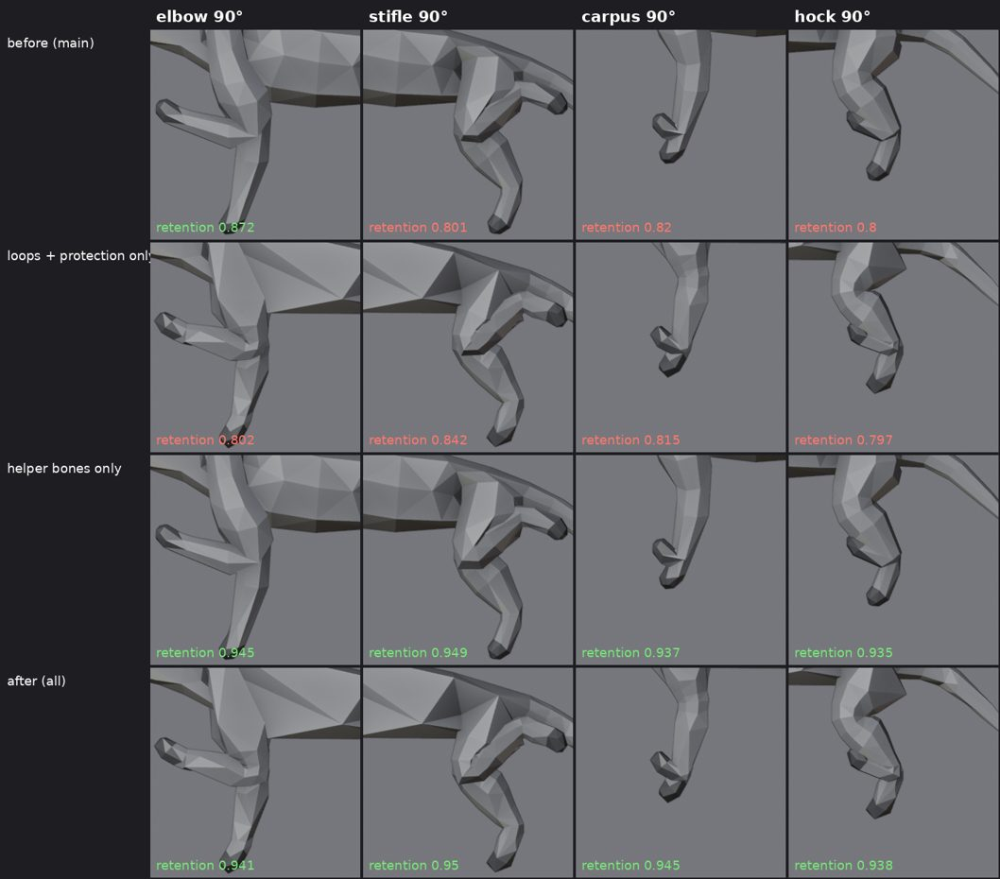
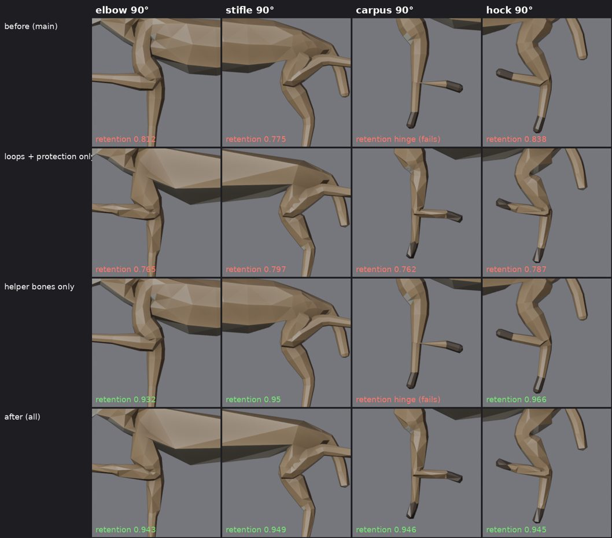

# pipeline3d: AI-assisted 3D asset pipeline, Blender → Godot 4

Turn a prompt or a concept image into a rigged, animated, collision-ready `.glb` that
Godot 4 imports with the right clip lengths and loop flags. Most of it runs unattended.
The stages that need a human are the web-only apps (Mixamo, AccuRIG) and judging the
concept image, and those stop with exact instructions.

```
 concept image ──► 3D generation ──► cleanup ──► rig ──► animate ──► export ──► Godot
 Nano Banana /      Tripo / Meshy /    weld, fill,  quadruped   procedural /  GLB +Y up,  headless import,
 Flux / manual      Rodin / Hunyuan3D  floaters,    auto-rig /  Mixamo /      NLA clips,  loop flags, audit,
                    or procedural      decimate,    Mixamo /    ActorCore /   collision   controller smoke test
                    Blender script     scale, origin AccuRIG /  mocap / API
                                                    API rig
```

Everything is plain Python and GDScript: **Blender 4.2+**, **Godot 4.3+**, and **Python 3.10+**
(or `uv`). The cloud generators are optional and need your own keys.

---

## What's in here

| Path | What it is |
| --- | --- |
| `forge.py` | Orchestrator. One JSON manifest per asset; resumable stages; stops with instructions at manual steps |
| `gen3d.py` | CLI for Tripo / Meshy / Rodin: generate, poll, download, auto-rig, animate. Standard library only |
| `fit_reference.py` | Reference fitting: Nano Banana draws a side view, Gemini marks the joints, and the result reshapes a low-poly creature preset (proportions, head, tail, real leg shapes). Standard library + `GEMINI_API_KEY` |
| `blender/*.py` | Stage scripts. Each has a `CONFIG` dict and a `main(config) -> report` and runs 3 ways (below) |
| `forge_server.py` | Local HTTP API around forge (token auth, manifest whitelist, job queue, uploads for manual steps, previews) |
| `forge_studio/` | **Forge Studio** web app: describe a model by text or voice, Gemini writes the manifest, one button builds it ([README](forge_studio/README.md)) |
| `godot_template/` | Godot 4 project: import plugin (loop flags, summary), asset viewer, character controller, audit and smoke-test tools |
| `manifests/` | Example assets: `karambit`, `fighter` (Mixamo), `wolf` (quadruped), `crate` (prop), `hero_api_rig` (hands-off API rig), `lowpoly_boar`, `wolf_fitted` (Nano Banana + fit), `horse_fitted` (fit from hand-placed joints, no key) |
| `mcp/` | Claude Desktop / Claude Code config for Blender MCP + Godot MCP |
| `docs/` | Tool matrix (free/trial options per stage), MCP prompt playbook, and the source-document analysis |
| `tests/` | End-to-end tests on procedural fixtures. No keys or credits needed |

### Blender stage scripts

| Script | Stage | What it guarantees |
| --- | --- | --- |
| `cleanup_for_godot.py` | cleanup | one joined mesh, welded, holes ≤ 4 sides filled, floaters removed, ≤ tri budget, real-world height, origin at feet; report with χ, non-manifold edges, UV tiles |
| `build_lowpoly_creature.py` | generate (procedural) | faceted low-poly wolf/boar/bear/deer/cat, ~900 tris, watertight, flat colours. Legs follow real stance anatomy (toe-walking, hoofed, flat-footed: elbow back, knee forward, hock back) and the joint positions are stored on the mesh so `quadruped_rig.py` puts bones exactly at the joints. `muscle` 0–1 adds thigh, gaskin (calf), upper-arm and forearm bellies, a thicker neck and a deeper chest. `joint_loops` gives every elbow, carpus, stifle and hock support rings and routed deformation loops; `protect_joints` makes decimation take triangles from the trunk and leg shafts instead of the joints, head, ears, tail and paws. `overrides.leg_chains` (from `fit_reference.py`) replaces the generic stance with a fitted animal's legs. Zero cost, no keys |
| `build_karambit.py` | generate (procedural) | 576-tri watertight karambit, exactly one ring hole (χ = 0), origin = ring centre = swivel pivot |
| `quadruped_rig.py` | rig + animate | 31-bone game skeleton + 8 volume helper bones (half-turn at elbow, carpus, stifle, hock, so bent joints keep their thickness in Godot), skinned (bone heat with leaked weights pruned, distance fallback, ≤ 4 influences), `idle` 2.5 s / `walk` 0.833 s / `attack` 1.7 s (bite at 1.3 s) / `death` 1.333 s, 30 fps, in place |
| `transfer_weights.py` | rig (clothing) | garments/armour get the body's weights (Data Transfer, nearest-face interpolated), parented, normalized |
| `merge_clips.py` | animate | Mixamo / ActorCore / mocap clip files → one armature, one NLA track per clip, optional root-motion strip |
| `udim_to_01.py` | UV fix | UDIM tiles 1002+ shifted back into 0-1, one material per tile |
| `bake_diffuse.py` | texture | high → low colour (and optional normal) bake, Cycles, cage 0.01 |
| `export_for_godot.py` | export | GLB, +Y up, clips start at t = 0, `-convcolonly` / `-colonly` collision helpers, copy into the Godot project |
| `bend_test.py` | QA | bends every leg joint to 90° and measures how much thickness the skin keeps (worst-decile retention ≥ 0.85) and whether any joint folds like a hinge. Runs automatically after the forge `quadruped` rig; `render_dir=` renders the bent legs |
| `render_preview.py` | QA | orthographic front/side/back/¾ PNGs, optionally posed on a clip frame, without a viewport |

Three ways to run any of them:

```bash
# 1. From Claude over Blender MCP (live scene):    run_script_file("cleanup_for_godot.py", {"import_path": "..."})
# 2. In Blender: Scripting tab → Open → edit CONFIG → Run Script
# 3. Headless:
blender -b -P blender/cleanup_for_godot.py -- import_path=incoming/raw.glb target_tris=12000
blender -b -P blender/cleanup_for_godot.py -- --config my_config.json
```

---

## Quick start (≈ 20 min setup, then minutes per asset)

1. **Install** Blender 4.2+, Godot 4.3+ (standard build), Python 3.10+ and [`uv`](https://docs.astral.sh/uv/).
   Check with `./pipeline3d/check_env_3d.sh`.
2. **Point the tools at your executables** (Windows PowerShell shown; use `export` on macOS/Linux):
   ```powershell
   $env:BLENDER = "C:\Program Files\Blender Foundation\Blender 4.2\blender.exe"
   $env:GODOT   = "C:\Tools\Godot_v4.4.1-stable_win64.exe"
   ```
3. **Your game project**: the example manifests export to `~/pipeline3d_game`, and forge creates it
   from `godot_template/` on the first run (it never overwrites files already there). To make it by
   hand, copy the template to a folder that doesn't exist yet: copying into an existing folder puts
   it one level too deep, and forge stops with the command that fixes it. Use Godot's
   `_console.exe` for `GODOT` on Windows so forge can read its output.
4. **Prove the chain works** (no keys needed; about 2 minutes):
   ```bash
   BLENDER=... GODOT=... ./pipeline3d/tests/run_all.sh
   ```
5. **Run a real asset**:
   ```bash
   python pipeline3d/forge.py pipeline3d/manifests/karambit.json    # procedural, fully automatic
   python pipeline3d/forge.py pipeline3d/manifests/wolf.json        # needs TRIPO_API_KEY (or set generate.file)
   python pipeline3d/forge.py pipeline3d/manifests/fighter.json     # stops at the Mixamo step with instructions
   python pipeline3d/forge.py pipeline3d/manifests/fighter.json --status
   python pipeline3d/forge.py pipeline3d/manifests/horse_fitted.json   # creature fitted to joints, no key
   GEMINI_API_KEY=... python pipeline3d/forge.py pipeline3d/manifests/wolf_fitted.json   # Nano Banana + fit
   ```
   Re-run the same command after a manual step and it resumes. `--from rig` redoes from a stage.
6. **Look at it**: open the Godot project and press F5. The asset viewer lines up every model in
   `res://assets` (Tab = next clip, arrows = orbit).
7. **(Optional) Agent control**: set up `mcp/` so Claude drives Blender and Godot directly
   (see [`docs/mcp-playbook.md`](docs/mcp-playbook.md)).

### Manifest cheat-sheet

```jsonc
{
  "name": "wolf",
  "concept":   {"tool": "banana", "prompt": "...", "out": "wolf_side.png"},   // or {"image": "path.png"}
               // or {"tool": "banana", "subject": "grey wolf", "auto_approve": true}: a measurable side view
  "generate":  {"provider": "tripo", "mode": "image", "options": {"face_limit": 10000, "quad": true}},
               // or {"procedural": "build_karambit.py", "config": {...}}  or {"file": "path.glb"}
               // or {"procedural": "build_lowpoly_creature.py", "config": {"preset": "deer", "muscle": 0.6},
               //     "fit_reference": true | {"animal": "horse", "keypoints": "my_joints.json"}}
  "cleanup":   {"target_tris": 8000, "target_height_m": 0.85, "remove_floaters_below": 0.02},  // false = skip
  "rig":       {"method": "quadruped" | "mixamo" | "accurig" | "tripo" | "meshy" | "none"},
  "animations":{"method": "procedural" | "clips_dir" | "tripo" | "meshy" | "none",
                "expect": ["idle", "walk"], "rename": {"standing_idle": "idle"}},
  "export":    {"collision": null | "convex" | "trimesh", "godot_project": "~/pipeline3d_game"}
}
```

Build outputs go to `pipeline3d/build/<name>/` (`refs/`, `incoming/`, `handoff/`, `work/`, `export/`,
`forge_state.json`, and `.forge/*.log` per Blender run).

---

## Which path for which asset

| Asset | Recommended path | Why |
| --- | --- | --- |
| Humanoid hero/NPC | concept → Tripo/Rodin (quad, 12-20k) → cleanup → **Mixamo** or **AccuRIG** → Mixamo/ActorCore clips | Best free humanoid rigs and the biggest free animation library |
| Humanoid, zero clicks | concept → **Meshy** image-to-3D → Meshy rig → Meshy animations (`hero_api_rig.json`) | Fully API-driven, costs credits, less control |
| Quadruped / creature | concept → Tripo → cleanup → **`quadruped_rig.py`** | Mixamo can't rig quadrupeds; procedural clips wire gameplay today and can be replaced later |
| Clothing / armour | generate each part separately → cleanup (`target_height_m: null`, `origin: KEEP`) → **`transfer_weights.py`** | Generated all-in-one characters clip and waste tris on hidden faces |
| Weapons, mechanisms, anything with holes or pivots | **procedural Blender script** (see `build_karambit.py`) | Generators fuse holes and misplace pivots; code is exact and repeatable |
| Stylized / low-poly animals, zero cost | **`build_lowpoly_creature.py`** preset → `quadruped` rig (`lowpoly_boar.json`) | No AI, no keys, 11 s from nothing to an animated asset in Godot |
| Any other four-legged animal, low-poly | closest preset + **`fit_reference`** (`wolf_fitted.json`, `horse_fitted.json`) | Nano Banana side view → Gemini joint marks → the preset takes the animal's proportions and leg shapes. Free-tier Gemini key, or hand-placed joints |
| Props / set dressing | Meshy/Tripo text-to-3D → cleanup → export `collision: convex` | Cheapest path; Godot builds the StaticBody |
| Environments / HDRIs / textures | **Poly Haven** through Blender MCP | Free (CC0) and already game-scaled |

Engine rules the scripts enforce: in-place clips (the controller moves the body); 30 fps;
clips start at t = 0 so loops close exactly; Blender and Godot both use OpenGL (Y+) normal
maps, so no green flip (only Unreal needs one); never join or apply transforms on a mesh that
is already skinned.

---

## Testing

| Test | Covers | Runtime |
| --- | --- | --- |
| `tests/run_all.sh` | every Blender stage on fixtures → Godot headless import → audit → controller smoke test | ~2 min |
| `tests/test_forge.sh` | forge manifests: procedural karambit, auto-rigged wolf, humanoid through the Mixamo gate (simulated with FBX files), fitted horse, fitted wolf through the no-key gates | ~2 min |
| `tests/test_fit_reference.py` (in `run_all.sh`) | fit round trip on every preset (joint error < 2 %), noisy keypoints stay watertight and fully skinned, the Gemini request path against a mock | ~1 min |
| bend test (in `run_all.sh` and every forge quadruped rig) | leg joints bent 90° keep ≥ 0.85 of their thickness; `rig.bend_test: {"strict": true}` stops the build on a failure | seconds |
| `tests/mock_gemini.py` | stand-in Gemini API (image + keypoints) for testing Nano Banana and fitting without a key | – |
| `godot --headless --path <game> -s res://tools/asset_audit.gd` | per-asset tris, bones, clips, texture sizes, collision; exit 1 on errors | seconds |

Headless Godot prints `texture_2d_get ... Parameter "t" is null` while making thumbnails; that
comes from the dummy renderer and is harmless.

Last verified in a Linux sandbox with Blender 4.2.9 LTS and Godot 4.4.1. Not verified there:
the cloud generators (they need your keys; the endpoints and auth were checked), real Gemini
calls for Nano Banana and joint marking (tested against `tests/mock_gemini.py`; how accurately
a given Gemini model marks joints on real images is untested), Mixamo and
AccuRIG (web/desktop apps), and the look of `get_viewport_screenshot` (the sandbox's virtual
display returns black frames).

---

## Reference fitting (Nano Banana + Gemini)

The presets cover five animals. For anything else with four legs, fit the closest preset to a
side view:

```bash
export GEMINI_API_KEY=...        # free key: https://aistudio.google.com/apikey
python pipeline3d/fit_reference.py --generate "spotted hyena" --image refs/hyena_side.png \
       --preset wolf --out fit.json --overlay fit.svg      # open fit.svg to check the joints
blender -b -P pipeline3d/blender/build_lowpoly_creature.py -- preset=wolf muscle=0.7 \
       "overrides=$(python -c 'import json;print(json.dumps(json.load(open("fit.json"))["overrides"]))')" \
       export_path=hyena.glb
```

In a manifest, `generate.fit_reference` does all of that between the concept and generate stages
(see `wolf_fitted.json`).

1. **Reference.** `concept.subject` asks Nano Banana (`banana.py`, now keyed by `GEMINI_API_KEY`)
   for a strict side view with the near legs apart, so every joint is visible.
2. **Joint marks.** A Gemini vision model (`gemini-3.5-flash` by default; `fit_reference.model` or
   `FIT_MODEL` to change) returns JSON:
   * torso depth at four slices;
   * neck, skull and muzzle slices, plus the nose and ear tip;
   * the tail;
   * six joints down the near front leg, five down the near hind leg.
3. **Fit.** The points become builder overrides: spine and head joints with radii, tail, ear
   length, stance and per-animal `leg_chains`. The legs then bend where the reference's legs
   bend (a horse's long cannon bones, a hyena's sloping back). Width, leg spread and colours
   stay from the preset, since a side view can't show them.
4. **Build and rig as usual.** The joint landmarks travel with the mesh, so the rig follows the
   fitted legs.

The fitter warns when the elbow or knee points the wrong way; that usually means Gemini marked
the far leg. Without a key, forge stops and says where to save hand-placed joints
(`handoff/fit_keypoints.json`, format from `fit_reference.py --schema`, example
`manifests/horse_keypoints.json`).

Only fit images you made or have the rights to use. Google's terms don't claim ownership of
images you generate; photos need the photographer's permission.

**Muscle.** `muscle` (0–1, per preset by default) adds muscle bellies inside the limb segments:
triceps over the humerus, forearm extensors, hamstrings and quads on the thigh, and the gaskin.
They are pushed behind the bone, where those muscles actually sit. It also thickens the neck
base and drops the belly line under the ribs and brisket (the brisket is the lower chest between
the front legs). Bones and landmarks don't move, so rigging is unchanged. At 900 tris the effect
is a silhouette change, not surface detail; raise `target_tris` (2–3k) to see more of it.

---

## Joints that bend without collapsing

Game engines (Godot included) skin with linear blending: a vertex shared between the upper and
lower leg moves to the average of where each bone would put it. At a 90° bend, that pulls a 50/50
vertex in to 71 % of its distance from the joint. The knee or elbow thins out, the "rubber hose"
look. Three fixes work together, and `bend_test.py` measures the result:

| Fix | What it does | Alone |
| --- | --- | --- |
| **Volume helper bones** (`quadruped_rig.py`, `volume_helpers`) | A bone on each elbow, carpus, stifle and hock turns half as far as the lower leg. The blended part of each joint vertex moves to it, so the joint turns as a rigid half-rotation. It's a Copy Rotation constraint that the glTF export bakes into every clip, including merged mocap clips, so Godot just sees animated bones | fixes the pinch (0.71–0.87 → 0.93–0.97), but not a joint with no geometry to bend (the horse's carpus stays a hinge) |
| **Deformation loops** (`build_lowpoly_creature.py`, `joint_loops`) | Support rings either side of each joint. Rings on the fold side are pulled toward the joint so they stack when it bends; rings on the outer side are spread to leave room to stretch over the elbow or kneecap. The fold side comes from each chain's real bend direction | gives every joint geometry to bend, but on its own scores 0.75–0.88: more vertices sit exactly where linear blending collapses |
| **Joint and detail protection** (`protect_joints`) | Decimation keeps the joints, head, ears, tail and paws, and takes the triangles from the long smooth tubes of the trunk and leg shafts (their facets get a little larger) | protecting joints only turned heads into cones at 900 tris; detail areas are protected with them |

Measured on the presets and a fitted horse (worst-decile retention, 90° bend, the gate is 0.85):

| | wolf | deer | bear | horse |
| --- | --- | --- | --- | --- |
| before | 0.80–0.87 | 0.71–0.86 | 0.80–0.86 | 0.78–0.84 + hinged carpus |
| helpers only | 0.94–0.95 | 0.93–0.97 | 0.95 | 0.93–0.97 + hinged carpus |
| loops + protection only | 0.80–0.84 | 0.75–0.88 | 0.75–0.85 | 0.76–0.80 |
| **all** | **0.94–0.95** | **0.93–0.95** | **0.94–0.95** | **0.94–0.95** |

For meshes from Tripo, Meshy or Rodin, whose edge layout can't be controlled, the helper bones do
the work. Forge warns when the bend test fails; add `"bend_test": {"strict": true}` to the rig
section to stop the build instead.




Close-ups of the left legs bent to 90°. Rows: before, loops + protection only, helper bones only,
all three. More: [deer](docs/images/bend90_deer.jpg), [bear](docs/images/bend90_bear.jpg), and the
[rest pose at the same budget](docs/images/bend90_rest_pose.jpg). Make your own:
`blender -b -P pipeline3d/blender/bend_test.py -- import_path=my_rigged.glb render_dir=renders`.
